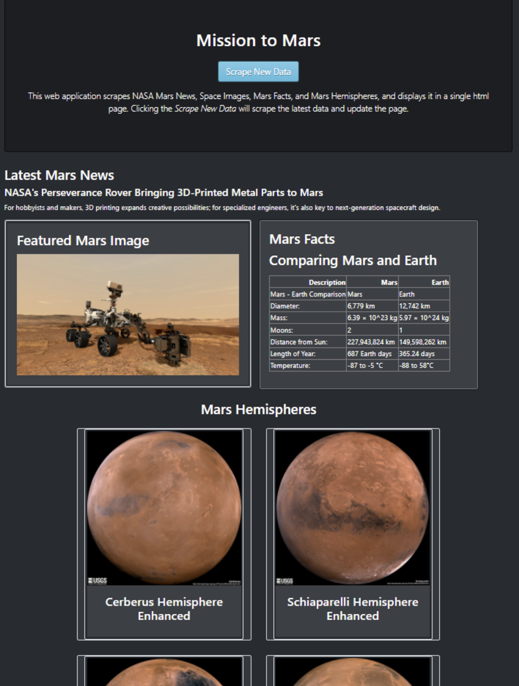

# Mission-to-Mars
In this analysis, we explore web scraping and the various tools used to extract information from active websites. We would use chrome dev tools to identify HTML components attached to the data we want to scrape. We would also use BeautifulSoup and Splinter to automate the web browser and gather the data we have identified. We would then use Mongo a non-SQL database to store the extracted data. To display the data, we would create a web application using flask. We would use all of these tools to identify, scrape, store, and display information from multiple websites that contain information about missions to mars. 

## Resources and Tools
* Tools: Splinter, Web-Driver Manager, BeautifulSoup
* Software: Python 3.9.5, Visual Studio Code 1.57.1, Jupyter Notebook 6.3.0
* Database: MongoDB
* HTML and CSS Bootstrap

## Components of the Web Scraping App
* Python script to perform the scraping
* HTML Index page to display results
* Flask App that connects the Python script to HTML and MongoDB in order to display the results

## Control Flow
1. Using the Chrome Developer tools, visit the NASA News website and identify the HTML tags that contains the information to scrape
2. Automate the Chrome browser using Splinter to visit the URL
3. Using BeautifulSoup, parse the HTML of the page.
4. Scrape all appropriate HTML tags for news title and article.
5. Similarly, Visit space images website and identify the HTML tags that contains the information to scrape
6. Automate the browser using Splinter an use BeautifulSoup to scrape the Mars featured image.
7. Next, using Splinter and BeautifulSoup, visit the galaxy facts website to scrape mars facts
8. Parse the scraped data to a dataframe and then convert to HTML table.
9. Finally, vsisit the mars hemisphers website and scrape full resolution images of all 4 mars hemispheres
10. In a python script, store all of the scraped data in MongoDB

## Results
### Mission to Mars Web App
  * The Scrape New Data button is styled: (btn-info)
  * The mars facts is styled: (Card-body)
  * The mars hemispheres images are styled as thumbnails; when clicked, they open up as full resolution images

### Full-Resolution Mars Hemisphere Images and Titles

### Mars Hemispheres Images as Thumbnails
##### When the thumbnail images are clicked they become full resolution images

### Mobile Responsive Web App

